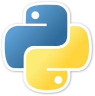

# Hi, I'm Helder 👋
### Engagement Manager

I'm a [Computer Engineering graduate](https://ingenieria.ucab.edu.ve/informatica/) with more than 20 years of experience in product development.

My specialties are Digital Transformation, [Agile](https://agilemanifesto.org/) and Technical Coaching.

Keywords: Engineering Manager, [Agile](https://agilemanifesto.org/), [Scrum](https://scrumguides.org/), XP, Kanban, Lean, [Java ](https://www.java.com/), [Python ](https://www.python.org/), TDD, BDD, DDD, Testing, QA, [Software Craftsmanship](https://manifesto.softwarecraftsmanship.org/)
